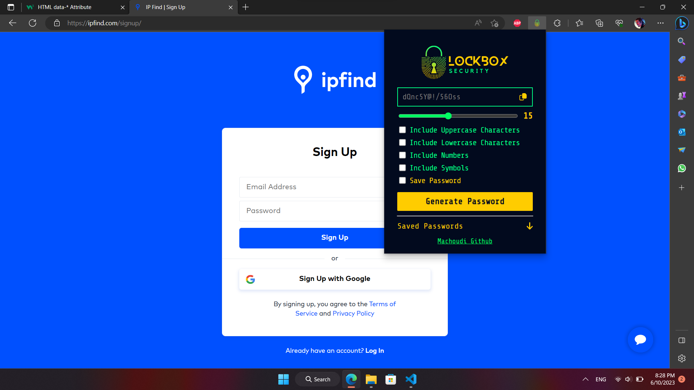

## Screenshots

# Chrome Extension: LockBox Password Generator

This is a simple Chrome extension that generates random passwords using HTML, CSS, and vanilla JavaScript.

## Features

- Generate random passwords with customizable length and character sets.
- Copy the generated password to the clipboard with a single click.
- save the generated password in your local storage and copy it when you need it.

## Installation

1. Clone or download this repository.
2. Open Google Chrome and go to `chrome://extensions`.
3. Enable the "Developer mode" using the toggle switch in the top-right corner.
4. Click on the "Load unpacked" button and select the directory where you cloned/downloaded this repository.

## Usage

1. Click on the extension icon in the Chrome toolbar to open the password generator popup.
2. Customize the password length and character sets (uppercase, lowercase, numbers, and symbols) according to your preferences.
3. Click the "Generate" button to generate a random password.
4. Click the "Copy" button to copy the generated password to the clipboard.
5. Use the generated password wherever you need it.

## Contributing

Contributions are welcome! If you have any suggestions, bug reports, or feature requests, please open an issue or submit a pull request.

## License

This project is licensed under the [MIT License](LICENSE).
